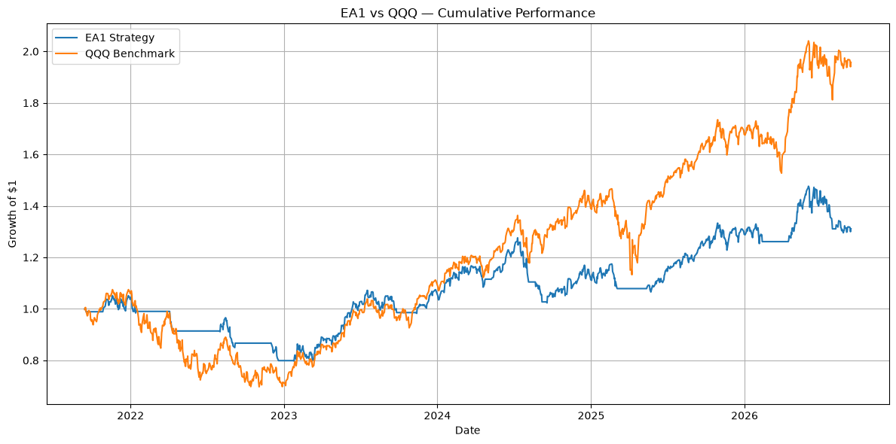

# EA1 — Baseline Research

## 1. Research Objective

EA1 is a simple trend-following strategy designed to investigate whether a basic moving-average approach can generate positive returns and how its performance behaves from a risk-adjusted perspective.

The purpose of this initial research is not to optimize the strategy, but to establish a **frozen baseline** that can be analyzed and improved through later research.

---

## 2. Research Question

> **Why can a simple trend-following strategy generate positive returns while still producing relatively weak risk-adjusted performance?**

This question motivates the analysis of:

* Returns
* Volatility
* Drawdowns
* Sharpe ratio
* Trade-level performance
* Benchmark performance
* Strategy limitations

---

## 3. Strategy

EA1 uses two exponential moving averages:

* **EMA20**
* **EMA50**

### Trading Rule

**EMA20 > EMA50 → Long position**

**EMA20 ≤ EMA50 → No position**

The strategy is intentionally simple. No additional indicators, optimization, machine learning, or parameter tuning are included in this baseline.

---

## 4. Asset and Research Period

**Asset:** QQQ

**Research period:** September 13, 2021 – September 14, 2026

Historical market data is retrieved using Yahoo Finance.

The baseline uses adjusted market data to account for relevant corporate actions.

---

## 5. Baseline Performance

| Metric | EA1 |
| --------------------- | ------: |
| Total Return | 31.23% |
| CAGR | 5.57% |
| Annualized Volatility | 15.05% |
| Sharpe Ratio | 0.44 |
| Maximum Drawdown | -24.18% |
| Closed Trades | 12 |

The strategy generated a positive return during the research period, but its risk-adjusted performance remained relatively modest.

For comparison, QQQ generated approximately **93.88%** over the same period.

---

## 6. Trade-Level Results

The baseline produced **12 closed trades**.

| Metric | Result |
| ---------------------- | -------: |
| Closed Trades | 12 |
| Win Rate | 50.0% |
| Average Win | +10.42% |
| Average Loss | -4.96% |
| Expectancy | +2.73% |
| Gross Profit | +62.52% |
| Gross Loss | -29.78% |
| Profit Factor | 2.10 |
| Average Trade Duration | 101 days |
| Median Trade Duration | 86 days |

There is also a currently open trade that is excluded from the closed-trade statistics.

---

## 7. Closed Trade Analysis

EA1 generated 12 closed trades during the research period.

| Trade | Entry Date | Exit Date | Return | Result | Holding Period |
|---:|---|---|---:|---|---:|
| 0 | 2021-09-16 | 2021-09-20 | -1.12% | Loss | 4 days |
| 1 | 2021-10-28 | 2022-01-18 | +0.13% | Win | 82 days |
| 2 | 2022-04-05 | 2022-04-12 | -7.69% | Loss | 7 days |
| 3 | 2022-08-02 | 2022-09-08 | -5.17% | Loss | 37 days |
| 4 | 2022-12-01 | 2022-12-20 | -7.83% | Loss | 19 days |
| 5 | 2023-01-25 | 2023-09-27 | +23.37% | Win | 245 days |
| 6 | 2023-11-13 | 2024-04-25 | +13.15% | Win | 164 days |
| 7 | 2024-05-08 | 2024-08-06 | -0.97% | Loss | 90 days |
| 8 | 2024-08-22 | 2024-09-09 | -7.01% | Loss | 18 days |
| 9 | 2024-09-17 | 2025-03-05 | +5.03% | Win | 169 days |
| 10 | 2025-05-14 | 2026-02-13 | +16.91% | Win | 275 days |
| 11 | 2026-04-16 | 2026-07-30 | +3.93% | Win | 105 days |

The trade distribution shows a classic trend-following characteristic: a relatively modest win rate combined with larger average winning trades.

Several extended winning trades generated a substantial portion of the strategy's cumulative return, while losing trades were generally smaller but occurred in clusters during unfavorable market conditions.

The 2022 sequence of losing trades is particularly relevant to the strategy's drawdown and risk-adjusted performance.

---

## 8. Initial Interpretation

The baseline produces an interesting result:

**Positive return does not automatically imply strong risk-adjusted performance.**

EA1 generated positive returns and had a positive trade expectancy, but the strategy also experienced substantial drawdowns and periods of elevated volatility.

The Sharpe ratio of **0.44** suggests that the return generated by the strategy was relatively modest compared with the volatility taken to achieve it.

This creates the central research problem for the next stage:

> **What characteristics of the strategy are responsible for the gap between positive returns and relatively weak risk-adjusted performance?**

---

## 9. Next Research Steps

The next stage will investigate:

1. Drawdown behavior
2. Volatility contribution
3. Trade distribution
4. Winning vs. losing periods
5. Exposure to the market
6. Benchmark comparison
7. Whether parameter changes improve robustness
8. Whether improvements survive reasonable transaction-cost assumptions

No strategy modifications are made in this baseline stage.

---

## 10. Research Philosophy

AyiQuant follows the principle:

**Theory → Data → Python Implementation → Backtest → Risk Analysis → Interpretation**

The objective is to understand **why** a strategy behaves the way it does before attempting to make it more complex.

---

**Status:** Baseline completed  
**Strategy:** EA1 — EMA20/EMA50 Trend Following  
**Stage:** Initial Quantitative Research
